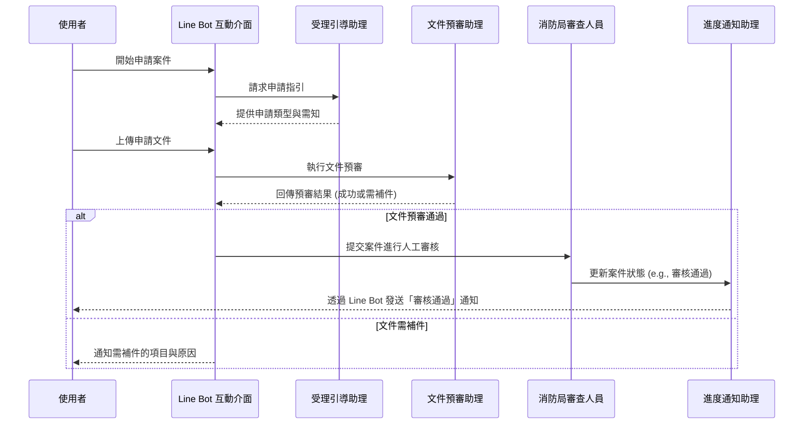
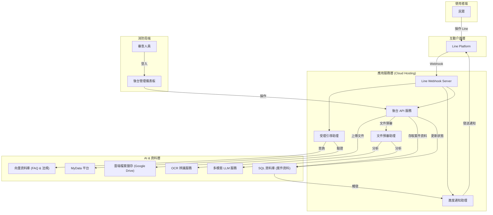
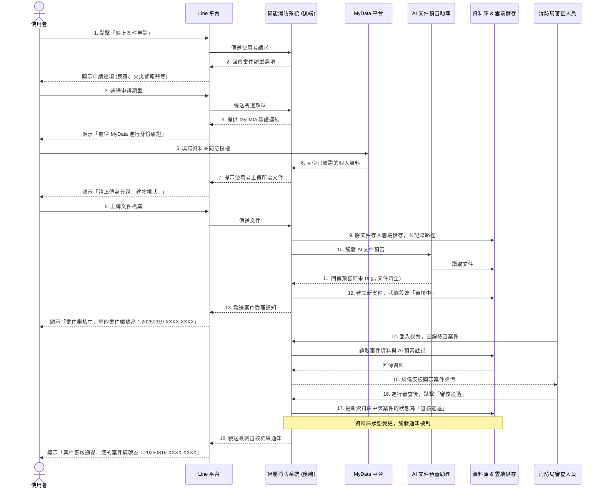

-----

# Line Bot 消防文書申請審核數據賦能系統產品需求文件 (PRD)

## 1\. 系統概述 / System Overview

本系統旨在透過 Line Bot 結合大型語言模型 (LLM) 與 MyData 平台，為臺東縣消防局打造一個 AI 智能消防申報系統。系統將傳統的紙本申請與人工審核流程，轉型為一個自動化、數據驅動的數位化服務平台。民眾可透過熟悉的 Line 介面，24 小時隨時進行案件申請、進度查詢與獲取消防安全資訊；消防局同仁則可藉由 AI 輔助預審，大幅提升行政效率與服務品質。

**核心價值主張 (Core Value Proposition)：**

  * **提升便民服務**：提供 24/7 全天候線上申請、進度查詢及常見問題回覆，打破地域與時間限制。
  * **優化行政效率**：導入 LLM 技術自動預審申請文件，標示常見錯誤與缺件，縮短人工審核週期並降低人力成本。
  * **數據驅動決策**：數位化申請流程所累積的數據，可供未來分析，優化審查標準與宣導策略，實現數據賦能。
  * **流程透明化**：民眾可即時追蹤案件處理狀態，提升政府服務的透明度與民眾滿意度。
  * **無紙化與永續發展**：將紙本作業轉為線上數位流程，目標提升數位申辦率至 70% 。

## 2\. 技術架構 / Technical Architecture

| 層級 (Layer) | 選用技術 | 說明 |
| --- | --- | --- |
| **使用者介面** | **Line Messaging API** | 提供民眾最熟悉、無需額外安裝 App 的互動介面。 |
| **應用程式後端** | **雲端應用程式託管 (Cloud App Hosting)** | 採用穩定、可擴展的雲端伺服器 (取代初期的免費 Ngrok)，處理 Line Webhook 與業務邏輯 。 |
| **AI 核心服務** | **多模態大型語言模型 (Multimodal LLM)** | 處理民眾上傳的文件（文字、圖片），進行資料擷取、完整性檢查與錯誤標示。 |
| **資料庫** | **SQL Database + Vector Database** | SQL 資料庫用於儲存案件申請資料；向量資料庫用於存放消防法規與常見問題，以實現快速語義搜尋。 |
| **資料儲存** | **雲端儲存 (Google Drive / Cloud Storage)** | 安全地儲存民眾上傳的申請文件與相關檔案 。 |
| **身份驗證** | **MyData 數位發展部個人化資料自主運用平台** | 串接政府 MyData 平台，讓民眾能安全、快速地帶入個人資料，簡化填寫流程。 |
| **訊息通知** | **Line Notify / E-mail** | 在案件狀態變更時，主動透過 Line 或電子郵件通知使用者 。 |

## 3\. 智能助理 (Agent) 架構 / AI Agent Architecture

本系統將導入以下智能助理角色，協同完成自動化流程：

| Agent 角色 | 核心職責 | 輸入 | 輸出 |
| --- | --- | --- | --- |
| **受理引導助理 (Intake & Guidance Agent)** | 1. 回應使用者查詢，提供不同案件的申請需知。<br>2. 引導使用者完成 MyData 身份驗證。<br>3. 根據向量資料庫內容，回覆常見問題。 | 使用者的文字或圖片查詢、選項點擊。 | 引導式訊息、申請連結、常見問題答案。 |
| **文件預審助理 (Document Pre-check Agent)** | 1. 透過 OCR 與 LLM 分析上傳的文件。<br>2. 檢查文件完整性（如：簽名、必填欄位）。<br>3. 標示出可能的錯誤或缺件，並生成初步修改建議。 | 使用者上傳的申請文件（身分證、建物執照、設備照片等）。 | 結構化的預審結果、錯誤標示、補件建議。 |
| **進度通知助理 (Status & Notification Agent)** | 1. 監控案件資料庫的狀態變更。<br>2. 當狀態更新時（如：審核中、已通過、待補件），即時發送通知給使用者。<br>3. 處理使用者的進度查詢請求。 | 內部審核系統的狀態更新、使用者的進度查詢指令。 | 個人化的 Line 通知訊息、當前的案件狀態與案件編號。 |

### Agent 工作流程圖



## 4\. 功能需求 / Functional Requirements

### 4.1 使用者端 (Line Bot) 功能

| 模組 | 主要功能 | 優先級 |
| --- | --- | --- |
| **案件申請** | - 提供多種案件申請入口（如：住宅用火災警報器、民宿、消防防護計畫書）。<br>- 透過 MyData 平台自動填入個資。<br>- 支援上傳多種類型檔案（圖片、PDF）。 | P0 |
| **進度查詢** | - 使用者可隨時查詢個人申請案件的最新狀態。<br>- 顯示案件編號、申請人資訊與目前處理進度（例如：處理中、審核通過）。 | P0 |
| **常見問題 (FAQ)** | - 提供圖文並茂的常見問題選單。<br>- 使用者可透過關鍵字查詢，由 AI 助理回覆相關消防法規與申請需知。 | P0 |
| **自動通知** | - 案件狀態變更時（如：收件、審核中、通過、駁回），系統自動發送 Line 通知。 | P1 |
| **合格場所查詢** | - 提供介面讓使用者查詢已通過消防安全檢查的合格場所。 | P1 |
| **意見回饋** | - 提供操作問題反應管道，收集使用者回饋以供系統優化。 | P2 |

### 4.2 消防局後台功能

| 模組 | 主要功能 | 優先級 |
| --- | --- | --- |
| **案件管理儀表板** | - 集中呈現所有線上申請案件。<br>- 顯示 AI 文件預審助理標示的重點或潛在問題。 | P0 |
| **審核流程整合** | - 審查人員可直接在系統內更新案件狀態，並觸發對民眾的自動通知。 | P0 |
| **數據分析與報表** | - 統計各類案件申請數量、平均審核時長、常見退件原因等。<br>- 提供數據視覺化報表，輔助管理與決策。 | P1 |

## 5\. 資料模型 / Data Models

系統將定義以下核心資料結構：

```python
from dataclasses import dataclass
from enum import Enum
from typing import List, Optional

class CaseType(Enum):
    """案件類型"""
    RESIDENTIAL_ALARM = "住宅用火災警報器"
    B_AND_B = "民宿"
    PROTECTION_PLAN = "消防防護計畫書"
    # ... 其他類型

class CaseStatus(Enum):
    """案件狀態"""
    PENDING_SUBMISSION = "待提交"
    UNDER_REVIEW = "審核中"
    APPROVED = "審核通過"
    REJECTED = "已駁回"
    NEEDS_CORRECTION = "待補件"

@dataclass
class UserProfile:
    """使用者資訊"""
    line_user_id: str
    user_name: str
    phone_number: str

@dataclass
class Document:
    """上傳文件"""
    document_id: str
    case_id: str
    file_name: str
    storage_path: str
    upload_timestamp: float

@dataclass
class CaseApplication:
    """案件申請主體"""
    case_id: str # e.g., 20250319-LZHT-4166
    user_id: str
    case_type: CaseType
    status: CaseStatus
    submitted_documents: List[Document]
    status_history: List[tuple[CaseStatus, float]] # 狀態與時間戳
    submission_date: float
    last_update: float
```

## 6\. 系統架構圖 / System Architecture Diagram



### **消防申報系統 - 新案件申請完整流程時序圖**


